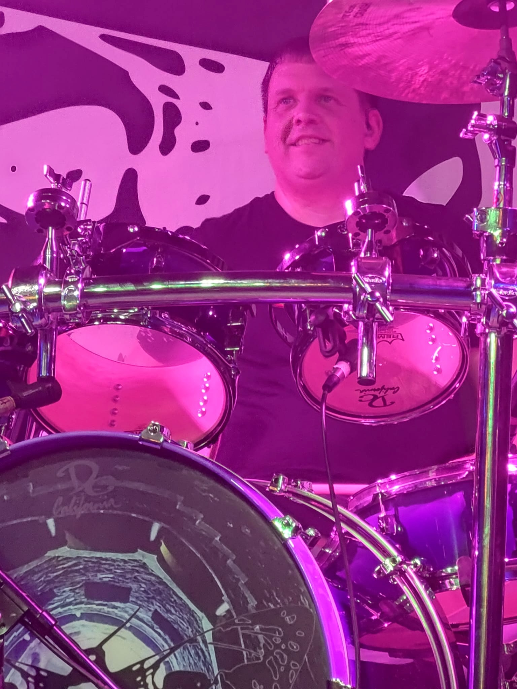

# Artist Biography: Rob Brennan

2022.03.12 - Rob Brennan proudly debuting the custom purple fade [DC California Custom Drums](http://www.dccalifornia.com) kit performing with _Wyatt Olney & The Wreckage_ at Tony V's in Everett, WA - Photo: [Ian Phares](https://www.facebook.com/ian.phares.1)

- TODO: Draft 3-5 paragraphs for my artist biography
- TODO: Add 3-5 YouTube or other video links

## Biography

## Stage Setup

My drum kit sports a sexy, custom hand-painted purple fade that I have been dying to have on stage - brought to life by [DC California Custom Drums](http://www.dccalifornia.com).

DC California Custom Drums

- Bass Drum: 19" x 24"
- Snare Drum: 6" x 13"
- Tom: 5.5" x 8"
- Tom: 6" x 10"
- Tom: 7" x 12"
- Floor Tom: 13" x 14"
- Floor Tom: 13" x 16"

Soultone Cymbals

- Hi-hat: 15" Extreme Series hi-hat pair
- Crash: 18" Extreme Series crash
- Crash: 20" Extreme Series crash
- Ride: 21" Extreme Series ride
- China: 18" Extreme Series china
- Crash: 16" Custom Brilliant Series crash

Additional hardware

- Bass Drum pedal: Tama Dyna-Sync double pedal
- Throne: Tama 1st Chair
- Hi-hat stand: Tama Iron Cobra 200 Hi-hat Stand

Electronics

- Alesis Strike MultiPad
- Shure PSM300 wireless in-ear monitoring system
- PreSonus Studio 1824c audio interface

## Contact information

Web

- Wyatt Olney & The Wreckage - [https://www.woatw.com](https://www.woatw.com)

Email

- [rob@therobbrennan.com](mailto:rob@therobbrennan.com?subject=[Soultone%20Cymbals]%20Artist%20Profile)

Social media

- Twitter - [@therobbrennan](https://twitter.com/therobbrennan)
- Facebook - [Rob Brennan](https://www.facebook.com/therobbrennan)

## Additional photos

### Soultone Cymbals

### DC California Custom Drums

### Other photos

