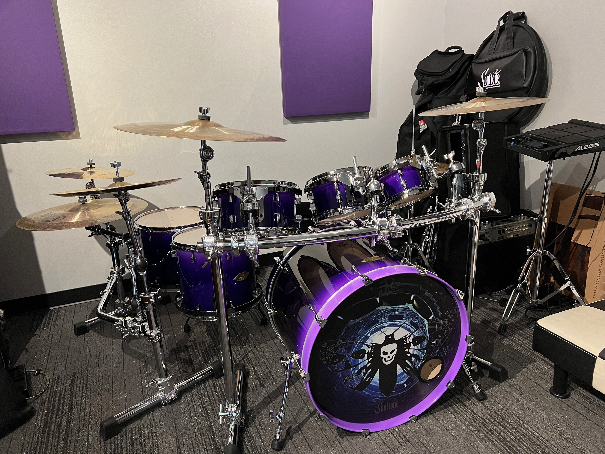
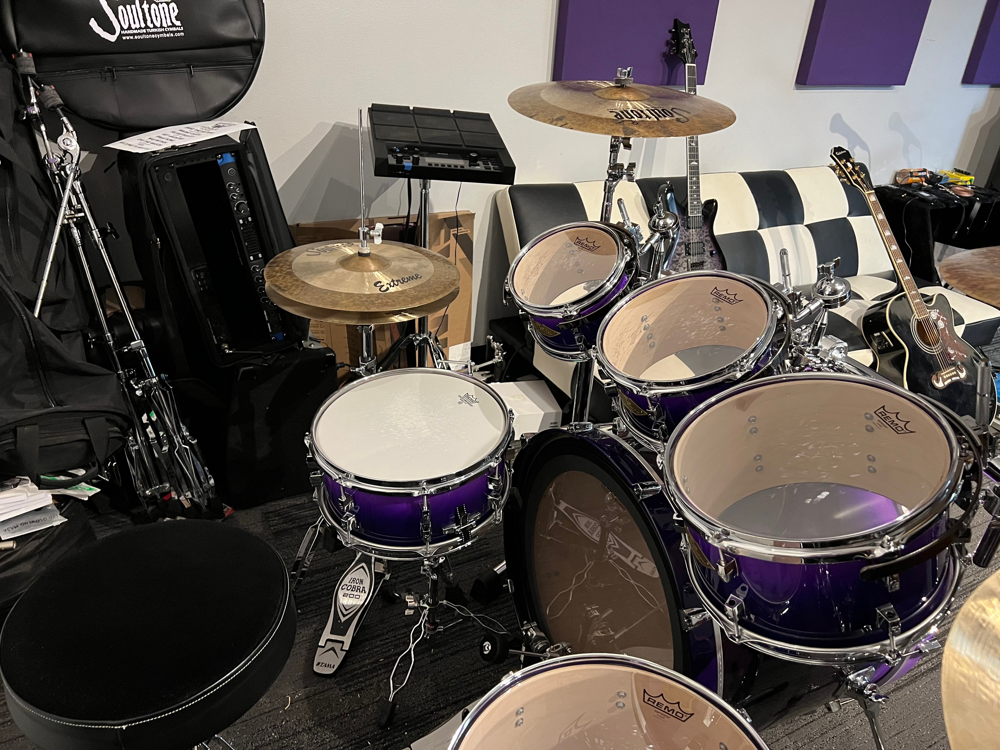

# Artist Biography: Rob Brennan

2022.03.12 - Rob Brennan proudly debuting the custom purple fade [DC California Custom Drums](http://www.dccalifornia.com) kit performing with _Wyatt Olney & The Wreckage_ at Tony V's in Everett, WA - Photo: [Ian Phares](https://www.facebook.com/ian.phares.1)

## Biography (short version)

TODO: Condense and simplify your biography into several paragraphs 😅

## Biography

Inspired to bang on a practice pad or boxes and pillows around the house since the age of six years old, music and rhythm have been the foundation of Rob's life. After his parents divorced in 1993, he moved to Upstate New York with his mother and sister - unaware of the opportunities in store.

On a whim, a last-minute choice to take a band class introduced him to one of the most pivotal figures in his life. The late [David Bournazian](https://www.timesunion.com/news/article/David-Bournazian-Mohonasen-s-renowned-music-6004045.php) - "B" as friends and loved ones knew him - wound up guiding and inspiring Rob to not only pursue drumming but to continually strive and pursue live performance while also living your best life.

"B" would not only serve as the foundation for continuing to inspire and challenge Rob, but he also had a knack for knowing when to put the hot-headed and occasionally arrogant teenager in check. The two shared many spirited conversations throughout their adventures - with Rob being the drumline captain of the renowned Mohonasen High School Field Band, throwing down behind the drum kit for the jazz and pep bands, and even performing in orchestral performance and arrangement.

Upon graduation from high school, Rob was involved in several jam bands while studying at Plattsburgh State University (Plattsburgh, NY) - heavily influenced by the live performance energy of great bands like Led Zeppelin, Metallica, Guns N' Roses, and Pantera with the experimental voyages of Pink Floyd, The Grateful Dead, MMW (Medeski, Martin, and Wood), and Phish. While performing with various bands, Rob was also involved in performing along the Atlantic Coast - including several jazz events in Myrtle Beach, SC.

In the early winter of 2007, Rob's love for the music of Phish crossed paths with his professional life after accepting a position at Goddard College in Plainfield, VT. Artistically, Rob was often spotted exploring rhythmic adventures on a djembe - to the delight of many students, faculty, and staff.

Rob moved from the Northeast to the Pacific Northwest during the summer of 2012 - embarking on a new adventure to blend his love of live performance, drumming, and creativity with technology. In the late winter of 2014, Rob decided to move from the quaint little town of Port Townsend, WA, right into the Fremont neighborhood of Seattle, WA.

In 2015, the right cosmic energy aligned. Rob was introduced to local singer/songwriter Wyatt Olney in a casual conversation with his girlfriend. Stylistically, Rob and Wyatt couldn't be further apart. Wyatt's masterful use of lyrical imagery, catchy hooks, and intentional pauses - mixed in with elements of hard rock and heavy metal - was the polar opposite to the jam band roots that are firmly part of Rob's artistic style and expression.

Fast forward seven years. Wyatt Olney & The Wreckage continues to excite and ignite fans throughout the Pacific Northwest - performing at some of Seattle's iconic venues (The Showbox, The Croc, El Corazón) and festivals. A regular guest on Seattle's KISW 99.9 FM, WOATW has appeared several times on "Loud and Local" and performed a headlining set at the Men's Room Redfestival.

2022 is on track to be an incredible year for Rob Brennan. In addition to performing and booking west coast tour dates for Summer 2022, he is also involved in writing and composing music for his new hybrid jam/electronic music project _Platypoose_.

## Media

Stay tuned for new performance and video footage from my custom [DC California Custom Drums](http://www.dccalifornia.com) kit in 2022 from our upcoming summer tour and recording sessions.

Music

- Spotify - [Wyatt Olney & The Wreckage](https://open.spotify.com/artist/3ExbLuST1For3zEAbbzNWC)

Videos

- [Wyatt Olney & The Wreckage - "War Within"](https://www.youtube.com/watch?v=9DkgVjpYB2Y)
- [Wyatt Olney & The Wreckage - "Swan Song"](https://www.youtube.com/watch?v=4ZNhcQXz4lM)
- [Wyatt Olney & The Wreckage - "TraumaQueen"](https://www.youtube.com/watch?v=WmsJONZEAZE)
- [Wyatt Olney & The Wreckage - "Get Haunted"](https://www.youtube.com/watch?v=lxEDUu9wHZk)
- [Wyatt Olney & The Wreckage - "Drag The Waters"](https://www.youtube.com/watch?v=oAPc10BUrMk)
- [Wyatt Olney & The Wreckage - "Welcome To Seattle"](https://www.youtube.com/watch?v=G4qpFCWK6k8)

## Stage Setup

My drum kit sports a sexy, custom hand-painted purple fade that I have been dying to have on stage - brought to life by [DC California Custom Drums](http://www.dccalifornia.com).

DC California Custom Drums

- Bass Drum: 19" x 24"
- Snare Drum: 6" x 13"
- Tom: 5.5" x 8"
- Tom: 6" x 10"
- Tom: 7" x 12"
- Floor Tom: 13" x 14"
- Floor Tom: 13" x 16"

Soultone Cymbals

- Hi-hat: 15" Extreme Series hi-hat pair
- Crash: 18" Extreme Series crash
- Crash: 20" Extreme Series crash
- Ride: 21" Extreme Series ride
- China: 18" Extreme Series china
- Crash: 16" Custom Brilliant Series crash

Additional hardware

- Bass Drum pedal: Tama Dyna-Sync double pedal
- Throne: Tama 1st Chair
- Hi-hat stand: Tama Iron Cobra 200 Hi-hat Stand

Electronics

- Alesis Strike MultiPad
- Shure PSM300 wireless in-ear monitoring system
- PreSonus Studio 1824c audio interface

## Contact information

Web

- Wyatt Olney & The Wreckage - [https://www.woatw.com](https://www.woatw.com)

Email

- [rob@therobbrennan.com](mailto:rob@therobbrennan.com?subject=[Soultone%20Cymbals]%20Artist%20Profile)

Social media

- Twitter - [@therobbrennan](https://twitter.com/therobbrennan)
- Facebook - [Rob Brennan](https://www.facebook.com/therobbrennan)
- Spotify - [Wyatt Olney & The Wreckage](https://open.spotify.com/artist/3ExbLuST1For3zEAbbzNWC)

## Additional photos

### Soultone Cymbals

### DC California Custom Drums

### Other photos

